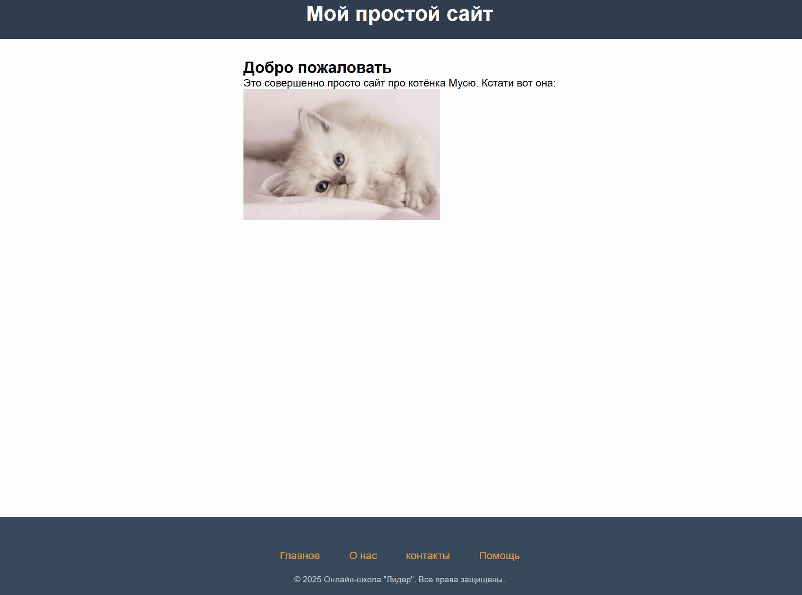

# Проект: "Шаблон для вашего сайта"

## Описание проекта
Готовый каркас для вашего сайта. В нём есть подвал в котором вы можете разместить ссылки на какую-либо информацию.

## Проект состоит из нескольких страниц:
(index.html) `Главная` - Содержит основной материал сайта.
(about.html) `О нас` - Здесь должна быть информация об авторах или самом сайте.
(contacts.html) `Контакты` - Эта страница должна включать контактную информацию для обратной связи.
(help.html) `Помощь` - В этом разделе можно разместить ответы на самые частые вопросы или помощь в использовании.

## Цели проекта
Создание шаблона для сайта с шапкой, подвалом и основной частью.

## Используемые технологии
- `HTML` для разметки и подключения функций сайта.
- `CSS` для придания красок сайту.

## Пример запуска
- Установите все необходимые файлы на ваш компьютер.
- На сайте есть ссылки на такие разделы как "О нас", "Контакты" и другие. В них можете указать свою информацию.
- Отредактируйте сайт под ваши желания и вкусы!

## Пример использования

### Проект выполнен в образовательных целях на онлайн-курсе "Основы Веб-разработки школы "Лидер".

